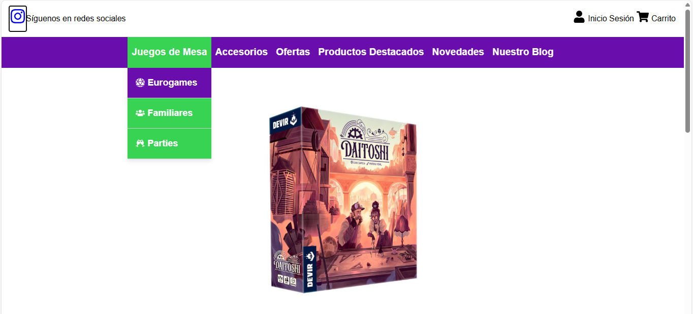
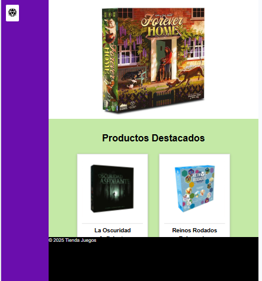
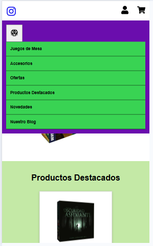
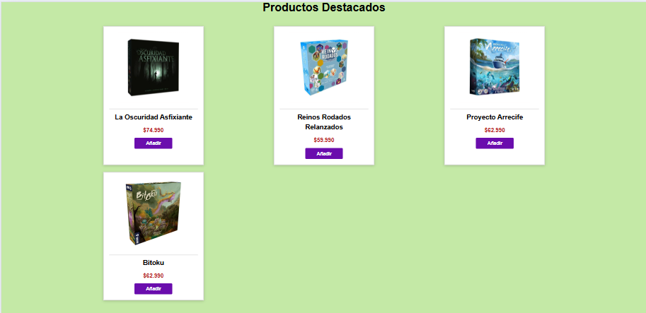

# 🎲 Proyecto Personal - Juegos de Mesa

Este proyecto es una aplicación web full stack desarrollada con TypeScript, que permite mostrar y gestionar productos de una tienda de juegos de mesa.  
Incluye funcionalidades como:

- Visualización de productos destacados con imágenes cargadas desde AWS S3.
- Subida de imágenes al bucket de Amazon mediante un formulario en el frontend.
- Almacenamiento de información del producto en una base de datos PostgreSQL.
- Backend desarrollado con Node.js y Express, utilizando consultas SQL para gestionar los datos.
- Comunicación entre frontend y backend a través de API REST.
- Uso de Context API para manejar el estado global relacionado con las imágenes.

El objetivo principal es crear una plataforma escalable y moderna para presentar productos de forma dinámica y profesional.

## 🚀 Tecnologías utilizadas

- HTML
- CSS
- JavaScript
- TypeScript
- SQL
- React
- Node.js
- Express
- PostgreSQL
- pg (node-postgres)
- dotenv
- ts-node
- nodemon
- Git & GitHub
- AWS (Amazon S3)


## 🖼️ (3 Tipos de vista)




## 🖼️ Sección de Productos Destacados (Renderizado con imágenes desde AWS S3)




## 🛠️ Funcionalidades

- Visualización de juegos de mesa con imágenes y descripción
- Carrusel con estilo personalizado
- Diseño adaptativo para móviles, tablets y Desktop

## 📦 Instalación

1. Clona el repositorio
```bash
git clone https://github.com/Matiasalbina/proyecto-personal-juegos-de-mesa.git
npm run dev para frontend
npm run dev para backend
